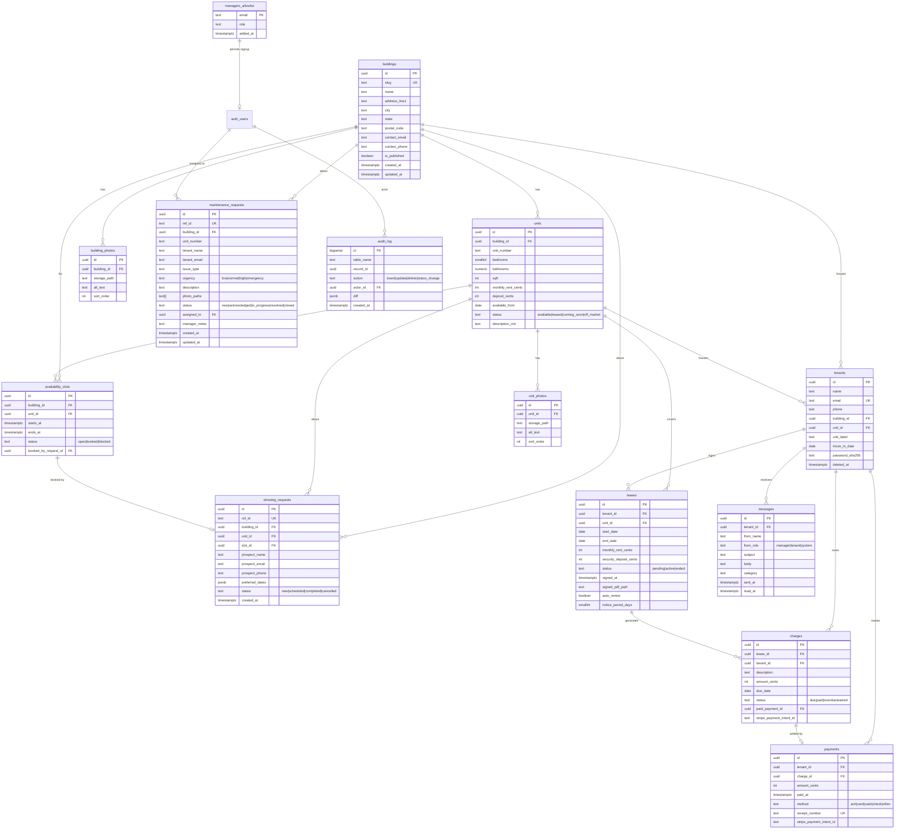

# Data model — ERD

Generated from `supabase/migrations/*.sql` as of 2026-05-20 (after F1 schema landed; S-series additions noted at the bottom and will be folded in after S-merges complete).

## Diagram

## Conventions

- All business tables include `created_at` (default `now()`), `updated_at` (touched by `set_updated_at()` trigger from migration `0100_init.sql`), and — where soft-delete applies — `deleted_at`.
- Foreign keys default to `on delete restrict` to avoid surprise cascades on financial data. The exceptions: `building_photos.building_id` and `unit_photos.unit_id` cascade so cleaning up a building/unit removes its photo refs.
- RLS is on for every business table. `anon` can read published `buildings` + `available` units only. `authenticated` users who pass the `is_manager()` check (added in migration `20260520000100_rls_tighten.sql`) can read/mutate everything. Tenant self-read policies are pending tenant-side Supabase Auth integration; until then portal reads use the service-role client.
- The `audit_log` table is populated by `write_audit()` triggers on every business table (`trg_audit_*`). Migration `20260520000300` extends coverage to `tenants/leases/charges/payments/messages`.

## In-flight additions (S-series, pending merge)

These tables are landing as part of the S-series feature work and will appear in the next regeneration of this doc:

| Slice | New tables / columns |
|---|---|
| S1 | `tenant_payment_methods` |
| S2 | `applicants`, storage bucket `leases` |
| S3 | `lease_documents`, `lease_chunks` (with `pgvector`) |
| S4 | `manager_calendar_connections`; new columns on `showing_requests` |
| S5 | `manager_preferences`, `notifications`, `email_events` |
| S6 | `vendors`, `work_orders`, `maintenance_surveys`; new SLA columns on `maintenance_requests`; storage bucket `vendor-coi` |
| S9 | `push_subscriptions` |
